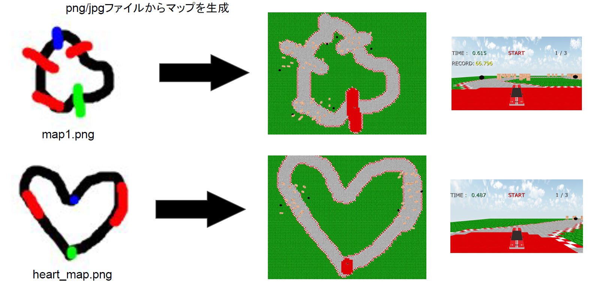

# HandDrawnMap
## 作品概要
プレイヤー自身でマップを作成できることが特徴の3Dカーレースゲームです。
ペイントソフトなどを用いて描いた単純なマップの絵からゲーム内のマップを生成し、そのマップを走ることができます。

## 実行動画

## 使用ツール
　C++ / DirectX12 
　Visual Studio2019

## 使用した外部ライブラリ

・DirectXTex：テクスチャを簡単に扱うために使用しました。

　
　https://github.com/Microsoft/DirectXTex

・DirectXTK12-main：ゲーム画面上で文字列を描画するために使用しました。

　https://github.com/microsoft/DirectXTK12

・opencv：png/jpgの読みこみのために使用しました。

　https://opencv.org/releases/

・json-develop：マップの情報をbinファイルに落とす際に使用しました。

　https://github.com/nlohmann/json

・Assimp_native_4.1_v142_4.1.0：FBXモデルを読み込む際に使用しました。

## 実行手順
・"HandDrawnMap\HandDrawnMap.exe"より実行してください。

## 操作方法
GoogleDrive：https://drive.google.com/drive/folders/19VHVhFHhikV_HFDJOoqM9EPigarisO-1?usp=sharing

にある

・"Hand-Drawn Map説明資料.pdf"をご参照ください。

・"マップの絵のルール.pdf"をご参照ください。

## 参考にした資料
### 書籍
「DirectX12の魔導書　3Dレンダリングの基礎からMMDモデルを躍らせるまで」

https://www.amazon.co.jp/dp/B082WY8HDH/ref=dp-kindle-redirect?_encoding=UTF8&btkr=1

### 記事
「[DirectX12]ハローワールドからFBXモデルを表示させるまで」

https://qiita.com/kyooooooooma/items/c43dd8b96cc104cb6713

